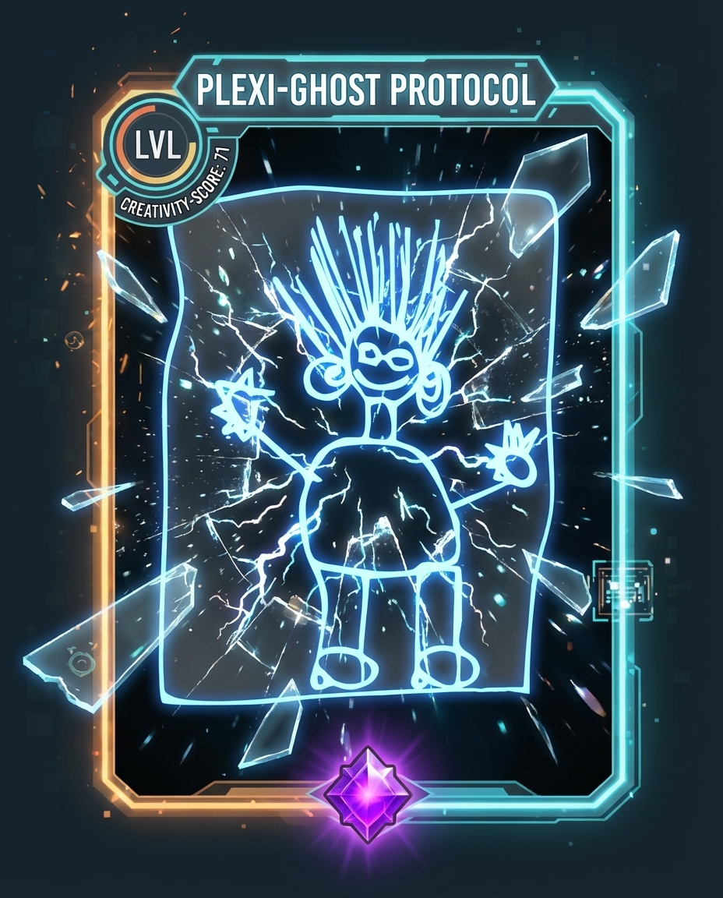
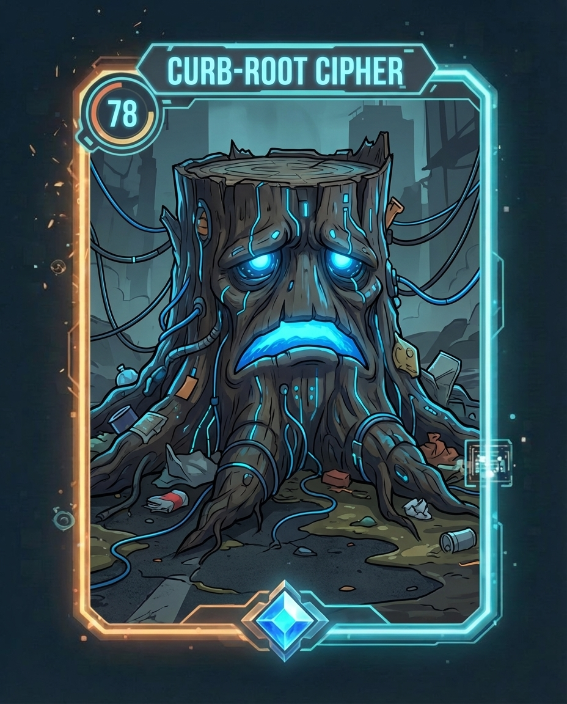
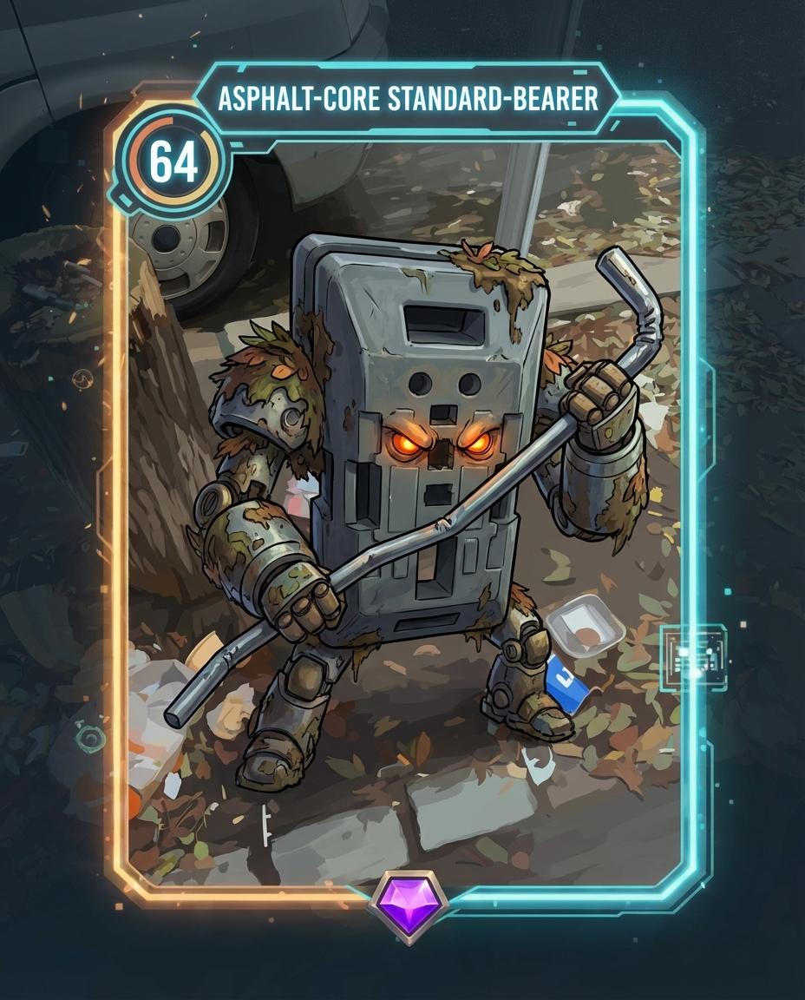
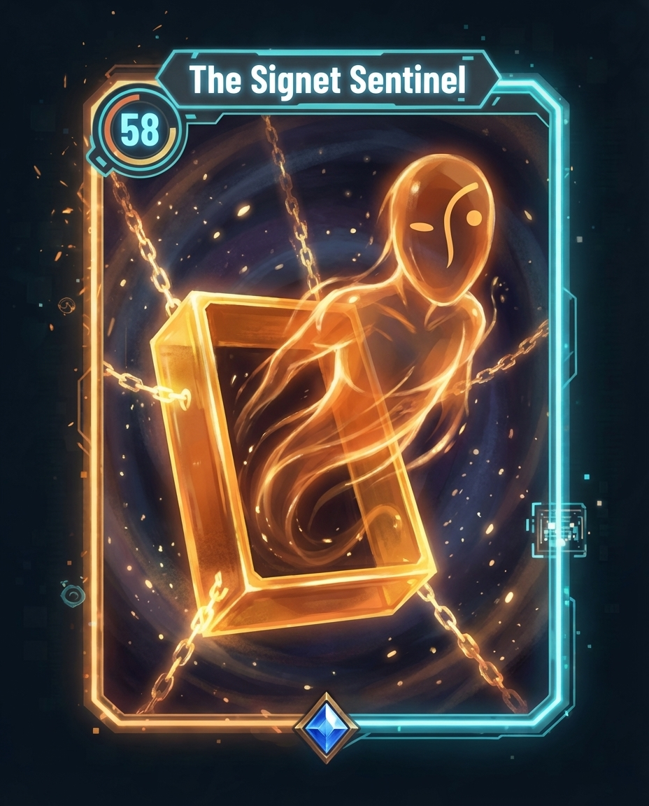

# Pareido: Seeing the Unseen

> "The world is full of junk that piles up into bizarre shapes. The game is a special scanner that uses AI to 'see' the true, stylish essence of these objects. Your camera is not just a lens, but a prism transforming the mundane into art."

**Pareido** is an AI-powered augmented reality game where you hunt for visual images in the real world. Unlike Pokémon GO, which ties invisible creatures to GPS coordinates, Pareido encourages observation and a creative view of your surroundings.

---

## Core Mechanics

### 1. The Capture & Decision Phase: "Keep or Salvage"

The process doesn't end with just taking the photo. Once the AI generates the "Resonant" (the character), you have a strategic choice to make immediately.

*   **The Scan**: You photograph a pile of scrap. The AI generates "Scrap Golem mk.1".
*   **The Choice**:
    *   **Option A: Stabilize (Save to Pocket)**: You spend a small amount of energy to keep the character in your collection. You do this if the generation turned out cool, unique, or high-tier.
    *   **Option B: Deconstruct (Salvage for Materials)**: You decide the character is ugly or too common. You "break it down."
        *   **Result**: The character is destroyed.
        *   **Reward**: You receive a large amount of raw materials (e.g., *20x Rust, 10x Plastic*).
    *   *Why this works*: Even "bad" photos are valuable because they fuel your resources for customization.

### 2. Advanced Crafting: "Style Augmentation"

You don't just breed characters; you can now edit them using the materials you collected from dismantling others. This is **Image-to-Image Inpainting/Editing** powered by game mechanics.

*   **The Workshop**: Select a Resonant from your Pocket.
*   **Infusion**: Spend your collected materials to add specific visual traits.
    *   *Spend 50 Organic Essence*: The AI adds moss, vines, and flowers to your Cyber-Robot.
    *   *Spend 50 Neon Essence*: The AI adds glowing runes or LED strips to your Stone Golem.
    *   *Spend 50 Textile Essence*: The AI dresses your character in a tattered cloak or stylish streetwear.
*   **Result**: You turn a basic "Random Gen" into a "Masterpiece" by carefully layering different materials.

### 3. The Social Flex: "The Grand Gallery"

This answers the question: "How do I show everyone I am better/more creative than them?"

*   **The Feed**: A global or local feed (like Instagram/Pinterest but for game characters) where players publish their best works.
*   **Curator Mode**: Players scroll and "Rate" other works.
    *   *Ratings aren't just likes.* Players award specific badges: "Avant-Garde," "Cursed," "Divine," "Trash-Core."
*   **The "Visionary Rank" (Your Creative Level)**:
    *   This is your "Level" in the game. It is **not** based on how much you walk or grind.
    *   It is calculated based on the **Engagement** your art receives.
    *   *Formula*: `(Views + Unique Badges + Saves) = Visionary XP`.
    *   **Ranks**:
        *   *Level 1*: Sightseer (Nobody knows you).
        *   *Level 10*: Trendsetter (You have followers).
        *   *Level 50*: The Oracle (Your style defines the meta of the game).
    *   **High Rank Perks**: Unlock exclusive AI filters, rare frames, and the ability to host your own mini-exhibitions.

---

## Summary of the Flow

1.  **Exploration**: Find trash/objects in the real world.
2.  **Interaction**: Scan it.
3.  **Strategy**:
    *   Is it cool? -> **Keep it.**
    *   Is it boring? -> **Deconstruct it** for materials.
4.  **Creativity**: Use materials to **customize/upgrade** your best characters.
5.  **Dominance**: Post your masterpiece to the **Gallery**. Gain "Visionary Rank" as people admire your work. Prove you have the best artistic eye.

---

## Examples

The scanning and transformation process in action. Left column shows raw input photos of everyday objects; right column shows the AI-generated "Resonant" character cards.

| Input (Raw Scan) | AI-Generated Card (Resonant) |
|---|---|
|  |  |
|  |  |
|  |  |
|  |  |

---

## Getting Started

### Installation

```bash
npm install
```

### Development

Start the development server:

```bash
npm run dev
```

### Build

Build for production:

```bash
npm run build
```

